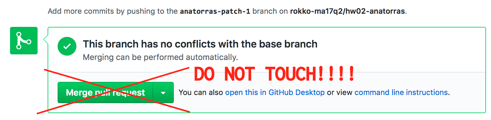

```{r setup, include=FALSE}
knitr::opts_chunk$set(fig.align = 'center')
source("../R/utils.R")
```

`r section("Mechanics")`

---

## Who am I?

- Name: 
  - **Kenji Sato**
  - PLEASE DO NOT address me as "Professor"
  - "Kenji" or "Sato-_san_" are preferable. "Sato-_sensei_" 
    is acceptable.
- Fields of Interest: 
  - Macroeconomic Dynamics
  - Economics of Innovation
  - Comparative Statics/Dynamics
  
---

## Contact

- Email: mail@kenjisato.jp
- Office Hours: 
  - Upon request (My office is in Osaka Prefecture University in Osaka...)
  - Ask me after the class. (Or on Skype/Slack if you prefer)

Except for private ones, ask questions in class 
or on Slack chatroom (discussed later).

---

## Course Schedule

- Schedule
    - Tuesdays 2nd period
    - Fridays 1st period
- Exam
    - Midterm exam on October 26, 1st period
    - Final on November 27, 2nd period

---

## Assessment

| Item                          | Weight    | Note                      |
|:------------------------------|:----------|:--------------------------|
| Attendance*                   | P/F       | fail if # of absense > 3  |
| Midterm exam                  | 40%       | Closed-book, Slow, MRW    |
| Final exam                    | 60%       | Closed-book, Ramsey & OLG |
| Homework/Active participation | Bonus     | Max 40%                   | 


* Those who attended Q1 Class are granted exemptions.

---

## Textbooks

We will study fundamental models of economic growth, using

- David Romer, _Advanced Macroeconomics_, 4th edition. McGraw-Hill. 2012. (5th would also be okay)

As a companion I'd recommend

- Charles Jones and Dietrich Vollrath, _Introduction to Economic Growth_, 3rd edition (2013, Norton) 

Other related materials will be announced in class. 

---

## Support

You can ask me on Slack. You will submit homework assignments through GitHub. So...

Let's setup technical stuff!


---

## GitHub <i class="fa fa-github"></i>

GitHub is a code-sharing platform designed for Git version control
system. 

We will use GitHub for assignment distribution and submission (except for purely mathematical ones). 


Create an account if you don't have one. Visit https://github.com/


Choose an account name very seriously.

---

## Slack <i class="fa fa-slack"></i>

We use Slack for random communications. 

- Updates and corrections to course materials will be 
  announed.
- You can ask anything non-private there. 
- You can answer the questions. (You will get active participation points.)


Join our Slack team here: [kjst.jp/slack](kjst.jp/slack)   
Use the same account id as GitHub! 

We will invite you as a member of #ma18q1 channel after you 
entered rokkoecon team. 

---

## First Homework Assignment!!!! (optional)

See list in kjst.jp/ma18q3hw

> Hand in by Pull Request.  
> Read the handout for details!

The installation process may require considerable efforts!  
Don't put it off; **START TODAY!**

If you have any problems start discussions on Slack.  
https://rokkoecon-slack-invite.herokuapp.com/ 


---

## Caveat

After making a Pull Request, you'll see something like this. 
Don't surrender to the tempatation to click on this button!

I merge, not you. Thanks.




---

## Resources on R

You might want to learn about R. I'd recommend

- [_R for Data Science_ by G. Grolemund and H. Wickham](http://r4ds.had.co.nz)

For advanced users: 

- [_Advanced R_ by H. Wickham](http://adv-r.had.co.nz)

For whom can read Chinese (I wish I could read this):

- [_R语言忍者秘笈_ by 谢益辉, 肖楠, 坑主三 and 坑主四](https://bookdown.org/yihui/r-ninja/)


---

`r section("Macroeconomics")`

---

## Growth models as a basis for many macro models

Macroeconomics is a study of huge field of study that encompasses such diverse subfields as

growth theory, monetary economics, public finance, labor economics, international finance, etc. ...

In this course we study Growth Models. 

---

## Why growth models

Acemoglu (2009) _Introduction to modern economic growth_, p. xv:

.small[

> While there is disagreement among macroeconomists about how to approach short-run macroeconomic phenomena and what the boundaries of macroeconomics should be, **there is broad agreement about the workhorse models of dynamic macroeconomic analysis. These include the Solow growth model, the neoclassical growth model, the overlapping generations model, and models of technological change and technology adoption**. Since these are all models of economic growth, a thorough treatment of modem economic growth can also provide (and perhaps should provide) an introduction to this core material of modem macroeconomics. [emphasis added]

]

---

## Models we study 

We study the following three models

- Solow growth model
    - Almost everything is exogenous but very good at explaining long-run behavior
- Neoclassical growth model
    - Ramsey model
    - Involves dynamic optimization
- Overlapping generations model
    - Suitable for addressing conflict of interest between generations

---

## Techniques you learn

We will be using mathematics and programing.

- Mathematics
    - Basics of differential equation.
    - Dynamic optimization in continuous time.
- Programing
    - R programing language
    - Data handling and visualization.
    - Reporting with R Markdown.

---

## What you don't learn (among many)

While you will learn some data-related techniques, 
in this course you will **not** learn

- Data preprocessing
    - i.e., Data retrieval and cleaning
    - We will be using already cleansed data only.
- Statistical analysis
    - i.e., Econometrics
    - The validity and limitation of the regression lines you 
      draw in this course must be investigated after serious study 
      of econometrics.

---

## Caveat

I will show you all the code I use to draw graphs.  
Do rerun the code yourself because you can learn how to code only by doing.

To be able to run the below code successfully, you need to setup your environment properly. (This is what hw01 and hw02 are about.)


```{r, message=FALSE}
library(tidyverse)
pwt90 <- haven::read_dta("~/Data/pwt90.dta")
```

---

## Economic phenomena we study

Here is the graph showing economic growth in the USA. 

```{r, out.width=350}
usa <- pwt90 %>% filter(country == "United States")
ggplot(usa) + geom_line(aes(year, rgdpo))
```

---

## Growth in per-capita Real GDP

Per-person GDP might be more important.

```{r, out.width=350}
usa_per_capita <- usa %>% transmute(year, rgdp_pc = rgdpo / pop)
(p <- ggplot(usa_per_capita) + geom_line(aes(year, rgdp_pc)))
```

---

## On log scale

Plot log(Per-person GDP) to see the trend.

```{r, out.width=350}
p + scale_y_log10()
```


---

## Fit 

$$\ln \text{GDP} = \text{const.} + g \times \text{Year}$$

```{r}
lm(log(rgdp_pc) ~ year, data = usa_per_capita)
```

This means that (approximately)
$$g = 2.1 \%$$

---

## Constant trend in growth

```{r, out.width=350}
gdp0 <- usa_per_capita$rgdp_pc[1]
p + geom_line(aes(x = year, gdp0 * exp(0.021 * (year - min(year)))))
```


---

## Question

There seems a constant trend in growth.
  - In the US, the annual per-capita real GDP growth rate is 2.1% on average

What is the engine of economic growth?
